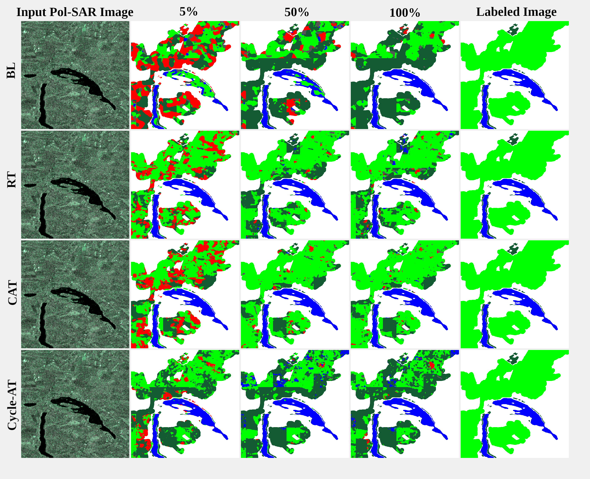

# Self-Supervised Learning for Semantic Segmentation of Pol-SAR Images via SAR-to-Optical Transcoding Using Pytorch

* This framework has been developed during my master thesis for the master degree in Information and Communication
 Engineering [@UniTN](https://www.unitn.it/ "UniTN website") -
 [Course Description](https://offertaformativa.unitn.it/en/lm/information-and-communications-engineering "Course website")
* If you want to discover every detail about the choices motivations and experiments you can check my
 [Final Dissertation](Docs/manuscript/manuscript.pdf "Final Dissertation")
 out.
* Instead, for a brief overview you can check out my [Final Presentation](Docs/manuscript/manuscript.pdf "Final Presentation").
* Here below I will explain how you reuse the code or repeat the experiments performed.
* Please you find this work helpful or interesting just drop a comment and let me now, if you have problem or
 curiosities do not hesitate to contact me.

## Visual Results
### Transcoding Results
Transcoding comparison between three randomly sampled areas and the three type of transcoders implemented


### Classification Results (% states for amount of labelled data employed)
Classification results comparison using different pretrained models and different amount of labelled data



## How to use this code
The repo is structured as follows:
```
. 
├── Data                                        
│   ├── Datasets 
│   ├── Test            ⮕ Here store the patches prepared accordingly to Lib/Dataset/EUSAR/
│   ├── Train           ⮕ For train and test sets
├── Docker              ⮕ Here is store the docker file configuration
├── Docs 
│   ├── arch            ⮕ Here there are some architecture images
│   └── manuscript      ⮕ Here there is the final manuscript
├── Lib                 ⮕ Here there are all the code resources
│   ├── Datasets 
│   │   ├── EUSAR       ⮕ Dataset Pytorch class overload
│   │   ├── processing  ⮕ Dataset preprocessing
│   │   └── runner      ⮕ Some runners to perform dataset processing
│   ├── Nets            ⮕ Here there is the implementation for each network deployed in this framework
│   │   ├── BL          ⮕ Fully supervised framework used as benchmark
│   │   ├── CAT         ⮕ Supervised Conditional Adversarial Transcoder
│   │   ├── Cycle_AT    ⮕ Unsupervised Cycle-Consistent Adversarial Transcoder
│   │   ├── RT          ⮕ Supervised Regressive Transcoder
│   │   ├── SN          ⮕ Segmentation Network to perform semantic segmentation using the features
                          learning during the transcoding phase.
├── eval.py     
├── mainBL.py           ⮕ Main file to train the Baseline
├── mainCAT.py          ⮕ Main file to train the Conditional Adversarial Transcoder
├── mainCycle_AT.py     ⮕ Main file to train the Cycle-Consistent Adversarial Transcoder
├── mainRT.py           ⮕ Main file to train the Regressive Transcoder
├── mainSN.py           ⮕ Main file to train the Segmentation Network
├── readme.md
```

## Getting started
* Create the dataset. This file  [EUSARDataset.py](Lib/Datasets/EUSAR/EUSARDataset.py "EUSAR Dataset Class") implements a Pytorch Dataset. To work
with it the data has to be stored as specified in the file in the folders of Data.
* The docker folder stores the file employed to built my docker image which is public
 [myDocker](https://hub.docker.com/repository/docker/cattale/pytorch "Docker Hub"). It includes the pytorch docker
 image with some additional library and setting.
* Docs store the final report of this work, so for any doubt refer to it, you can find almost everything.
* In Lib there are all the libraries used to perform the network's operations.
* Once you have prepared the repo, the dataset, and the docker image you can run the main files.

### Prepare the Dataset
The data employed in my work was coupled radar and optical images:
* Radar images was dual polarized C-Band Sentinel-1 products
* Optical images was RGB+NIR Sentinel-2 images
* The labelled set was composed of 
 * Forests.
 * Streets.
 * Fields.
 * Urban.
 * Water.

All the images employed were 10x10 meters resolution.
You can follow the instruction [EUSARDataset.py](Lib/Datasets/EUSAR/EUSARDataset.py "EUSAR Dataset Class") and create a dataset compliant with my EUSARDataset class or recreate your own,
In the former you have 100% compatibility, in the latter you could encounter some problems.

### Prerequisites
All the training of the networks implemented have been performed on an Nvidia GeForce RTX 2070 SUPER with 8GB
of dedicated memory. The code requires at least 8 GB of free GPU and 8 GB of free RAM. In the report you can find
approximately the running times.

### Prepare the Machine
To prepare the docker you can run this command:
```shell
docker create --name [yourPreferredName] --gpus all --shm-size 8G -it -v [folder/Path/To/Project]:[Folder/In/The/Docker] cattale/pytorch:latest
```
Between square brackets are parameters you can change:
* [yourPreferredName] choose a name for your container (here you should clone the project)
* [folder/Path/To/Project] the folder in which you store your project
* [Folder/In/The/Docker] folder in the docker container where you will run your code

### Configure the Test
Now you need to configure the scripts to run the test you want to perform.
The parameters are configured as follows when a script is launched:
* The [general_parser.py](Lib/Nets/utils/config/general_parser.py "General Parser") defines all the configurable parameters. So refer to
it for a detailed list
* After the parsing of the argument passed to the script is possible to modify them in a mask in the mains using the
[specific_parser.py](Lib/Nets/utils/config/specific_parser.py "Specific Parser"). This script basically overwrite the argument which are
 specified, it is useful when a lot of parameters change over tests.
* Lastly the [config_routine.py](Lib/Nets/utils/config/config_routine.py "Configure Routine") is run. This script configures the
  environment based on the parameters defined.

### Run the Code
To run the script follow these instructions.
* Start your docker container using the command ```docker container start [container_name]```
* Then enter in your container using the command ```docker container attach [container_name]```
* Now navigate in the container up to the project folder and run one of the provided mains.
 *  [mainBL.py](mainBL.py "Train the Conditional Adversarial Transcoder")
 *  [mainRT.py](mainRT.py "Train the Regressive Transcoder")
 *  [mainCAT.py](mainCAT.py "Train the Conditional Adversarial Transcoder")
 *  [mainCycle_AT.py](mainCycle_AT.py "Train the Conditional Adversarial Transcoder")
 *  [mainSN.py](mainSN.py "Train the Segmentation Network")
* To run the script above run the command ```python main*.py```

## Acknowledgments
Last but not least this implementation is based on the work of [Zhu et al. 2017a](https://github.com/junyanz/pytorch-CycleGAN-and-pix2pix "pytorch-CycleGAN-and-pix2pix").
